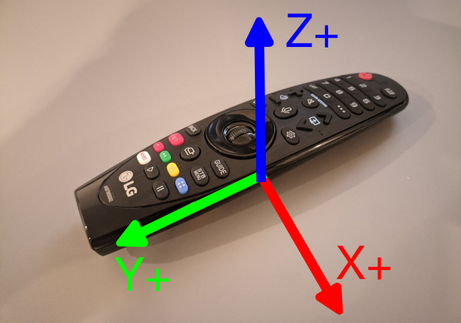

# LG Magic Remote (MR20) — Linux Driver, Daemon and Native C Tools

**Language:** **English🇬🇧** [Русский🇷🇺](README.ru.md)



## Overview

This project is the **native C successor** of the original LG Magic Remote
project. The Linux kernel driver for the MR20 remote (Bluetooth HID device
`000f:3412`) is the foundation; the original Python toolchain has been
**completely replaced by C**: one `lg-magic` binary (libc/libm only) and
one system daemon `lg-magicd` (sd-bus + polkit).

The v2 architecture is a **thin kernel, fat userspace** split:

```
                        raw_only=1 (default)
 ┌──────────────┐  decodes LG reports      ┌────────────────────────────┐
 │ lg_magic.ko  │ ───────────────────────→ │ evdev "LG Magic Remote"    │
 │ (kernel)     │  buttons (lg_btn_map),   │   EV_KEY + REL_WHEEL       │
 │              │  wheel→REL_WHEEL,        │ evdev "LG Magic Remote IMU"│
 │              │  IMU (EV_ABS),           │   EV_ABS + MSC counter     │
 │              │  NO airmouse             └──────┬──────────┬──────────┘
 └──────────────┘                                │ IMU (never grabbed!)
                                                 ▼          │ EVIOCGRAB
                                        ┌──────────────────┴─────────────┐
                                        │ lg-magicd (root, systemd)      │
                                        │  profile · calibration · map   │
                                        │  wheel×scroll_speed · airmouse │
                                        │  state: /var/lib/lg-magic/     │
                                        └───┬──────────────────┬─────────┘
                               uinput     │                  │  sd-bus (org.lgmagic)
                   ┌───────── "lg-magicd keyboard <identity>" ─┼── polkitd
                   ▼                                          ▼
            per remote: one virtual mouse            CLI `lg-magic`
            + keyboard (names carry the MAC)         (libc/libm, own D-Bus client)
```

What this means in practice:

- **The remote works standalone.** The kernel decodes buttons and the
  wheel directly (`raw_only=1`, the v2 default) — the remote keeps
  working even when the daemon is not running.
- **The daemon adds the rest.** `lg-magicd` grabs the keyboard evdev
  (only *after* its virtual devices are ready) and adds the airmouse,
  profiles, button mapping, scroll speed and calibration on top, through
  **one virtual mouse + one virtual keyboard per remote** — the pair is
  named after the remote's identity (`lg-magicd keyboard <MAC>` /
  `lg-magicd mouse <MAC>`, `unknown` when the MAC is not readable), and
  held keys are tracked per remote. When the daemon stops — including
  crashes — the grab is released with its file descriptors and the
  remote falls back to raw kernel input.
- **Zero runtime dependencies for the CLI** — `lg-magic` is built against
  libc/libm only and talks to the daemon over D-Bus with a small
  hand-rolled client (no libsystemd, no Python). The daemon links
  libsystemd (sd-bus) and logs to the journal.
- **Privileged writes go through the daemon + polkit.** Two actions:
  `org.lgmagic.profile-set` (active sessions allowed) and
  `org.lgmagic.modify-input` (admin authentication). Reading device
  state never needs root. Settings live in `/etc` and `/var`, never in
  `/usr`; the global BlueZ configuration is not touched.
- **Packaged for three distros** — `.deb` (Ubuntu/Debian), `.rpm`
  (Fedora) and an Arch PKGBUILD, all with DKMS module registration,
  built and released by CI.
- **Byte-for-byte parity** with the original Python scripts, verified
  against committed golden data (see TESTING.md).

The original Python scripts remain in `scripts/` for reference only.

## Features

### Kernel module (`lg_magic.ko`)

- Full button decode (power, digits, navigation, media, color buttons)
  via a static key map — mode-independent, identical to v1
- `raw_only=1` (default): the wheel reports **only** `REL_WHEEL` and no
  key emulation, and no airmouse is generated in the kernel
- `raw_only=0`: the complete v1 behaviour (kernel-space airmouse with
  bias/scale calibration and low-pass filtering, wheel key emulation /
  BTN_LEFT in airmouse mode)
- A separate `LG Magic Remote IMU` evdev device exposing raw 6-axis data
  (accelerometer + gyroscope) with a hardware timestamp counter
  (always present under `raw_only=1`)
- Calibration loaded from `/lib/firmware` (per-remote by Bluetooth MAC,
  with a generic fallback)

### The `lg-magicd` daemon

- Discovers the remote's keyboard and IMU evdev devices (paired by
  Bluetooth MAC from sysfs), hotplug-aware
- Grabs the keyboard **after** creating the virtual mouse and keyboard —
  a restart or crash never leaves the remote dead
- Per-device profiles: button mapping, scroll speed, sensitivity,
  calibration path — applied immediately, without a restart
- Airmouse through the daemon with the v1 signs, scale and LPF
- sd-bus interface (`org.lgmagic`, `/org/lgmagic/Manager`) with polkit
  authorization on every mutating method; device identities are validated
  ("unknown" or a 17-char BT MAC — anything else is
  `org.lgmagic.Error.InvalidArguments`) and the `ApiVersion` property
  (`"2.0"`) lets clients check compatibility; the IMU evdev device is
  never grabbed, so `lg-magic imu` works in parallel

### The `lg-magic` binary

| Subcommand | Purpose |
|---|---|
| `lg-magic analyze` | Decode HIDRAW reports from the remote (replaces `lg_magic.py`) |
| `lg-magic imu` | Read the IMU via evdev: raw display, `--csv` recording, `--ahrs` orientation, `--cube` terminal cube, `--mouse` uinput airmouse |
| `lg-magic calibrate` | Fit accelerometer (Levenberg–Marquardt) / gyroscope calibration from a CSV recording |
| `lg-magic calib2bin` | Convert a calibration JSON into the 32-byte kernel firmware blob |
| `lg-magic config` | Show / change the TOML configuration (including `migrate` from v1 JSON) |
| `lg-magic setup` | Interactive wizard: mode choice, configure, calibrate, install — end to end |
| `lg-magic device` | `list` the daemon's devices / `status` of one device (no root needed) |
| `lg-magic profile` | `list` profiles, `show` the active one, `set` it (polkit: profile-set) |
| `lg-magic button` | `list` the key map, `map`/`reset` buttons (polkit: modify-input) |
| `lg-magic scroll` | Wheel speed and airmouse sensitivity (polkit: profile-set) |
| `lg-magic diagnose` | Collect version, kernel, module, device, config and daemon state into a report for bug reports |

## Requirements

- **Linux** with a running kernel
- **DKMS** and **kernel headers** — to build the module (handled
  automatically by the packages; on Fedora you need a matching
  `kernel-devel` on the target machine, and on Arch `dkms` comes from
  the AUR)
- **libsystemd** (runtime library for `lg-magicd`) and **polkit**
  (recommended; without a running polkitd the daemon rejects all
  mutating calls except from root)
- **gcc + make** — only if you build from source

The `lg-magic` binary itself needs nothing at runtime beyond libc/libm.

## Installation

### 1. Release packages (recommended)

Download the package for your distro from the latest
[GitHub Release](https://github.com/sirfragles/lgmagic/releases):

```bash
# Ubuntu / Debian
sudo apt install ./lg-magic-dkms_2.0.1-1_amd64.deb

# Fedora
sudo dnf install ./lg-magic-2.0.1-1.fc42.x86_64.rpm

# Arch
sudo pacman -U ./lg-magic-2.0.1-1-x86_64.pkg.tar.zst
```

The packages install `/usr/bin/lg-magic`, `/usr/libexec/lg-magicd`
(`/usr/lib/lg-magicd` on Arch), the systemd unit, the polkit policy, the
D-Bus configuration, the default TOML config, the udev rule and the DKMS
source tree — and register the module with DKMS, which builds
`lg_magic.ko` for your kernel and keeps it rebuilt on kernel upgrades.
The daemon is **not auto-started**: run the wizard, which enables it.

### 2. Build from source

```bash
make              # kernel module + lg-magic + lg-magicd
make check        # build the tools and run the full test suite
sudo make install # binaries, unit, policy, dbus conf, tmpfiles, config
sudo modprobe lg_magic
```

### 3. Manual DKMS install

```bash
sudo mkdir -p /usr/src/lg-magic-2.0.1
sudo cp Makefile dkms.conf COPYING /usr/src/lg-magic-2.0.1/
sudo cp -r kernel include /usr/src/lg-magic-2.0.1/
sudo dkms add -m lg-magic -v 2.0.1
sudo dkms build -m lg-magic -v 2.0.1
sudo dkms install -m lg-magic -v 2.0.1
# DKMS builds the module only — install the tools separately:
make tools && sudo make install
```

## Quick start

After installing, run the wizard — it walks through the input mode
choice, calibration, daemon setup and an airmouse test:

```bash
sudo lg-magic setup
```

Steps performed by the wizard:

1. **Environment check** — root, module loaded, devices detected
   (`/dev/uinput` included)
2. **Input mode** — the v2 default **daemon mode** (`raw_only=1
   imu_evdev=1`, enables `lg-magicd`), or the v1 behaviour **kernel
   airmouse** (`raw_only=0 airmouse=1 imu_evdev=1`)
3. **Module parameters** — writes `/etc/modprobe.d/lg-magic.conf` and
   reloads the module
4. **Accelerometer calibration** — "slowly rotate the remote in all axes"
   (20 s recording, Levenberg–Marquardt fit, quality validation)
5. **Gyroscope calibration** — "put the remote down and don't touch it"
   (10 s recording, mean bias)
6. **Calibration tuning** — LPF alpha and sensitivity questions
7. **Firmware blob** — **kernel airmouse mode only**:
   `lg_magic_calib_XX_XX_XX_XX_XX_XX.bin` for your remote's Bluetooth
   MAC (+ `lg_magic_calib.bin` fallback) in `/lib/firmware/`. In daemon
   mode this step is skipped on purpose — the calibration JSON is the
   single source and the blob would be a second, stale copy.
8. **Daemon state** (daemon mode) — writes
   `/var/lib/lg-magic/<MAC>/calibration.json` and
   `/etc/lg-magic/devices.d/<MAC>.toml`, and enables `lg-magicd`
   (`systemctl enable --now`, best-effort); the recordings
   (`calib_accel.csv` / `calib_gyro.csv`) land next to the JSON in
   `/var/lib/lg-magic/<MAC>/`
9. **Module reload** — verified with `dmesg` ("Loading LG Magic calibration")
10. **Airmouse test** — "move the remote, Ctrl+C ends" (in daemon mode
    this reads the daemon's status and falls back to the standalone test)
11. **User configuration** — `~/.config/lg-magic/config.toml` with the
    calibration path and airmouse tuning
12. **Summary** — what was done and how to repeat or undo it

`--non-interactive` accepts the defaults everywhere (for scripting).

## Usage

Run `lg-magic --help` or `lg-magic <subcommand> --help` for details.

```bash
# HIDRAW packet analyzer (auto-detects the remote by VID/PID 000f:3412)
lg-magic analyze                        # or --device /dev/hidrawN / --list

# Raw IMU display (auto-detects the "IMU" evdev device)
lg-magic imu

# Record raw samples for calibration
lg-magic imu --csv samples.csv --duration 20

# Orientation angles (Madgwick AHRS) / terminal cube (implies --ahrs)
lg-magic imu --calib calib.json --ahrs
lg-magic imu --calib calib.json --cube

# Standalone uinput airmouse (needs the udev rule + input group, or root)
lg-magic imu --calib calib.json --mouse

# Calibration from a recording
lg-magic calibrate samples.csv calib_accel.json --accel
lg-magic calibrate samples.csv calib_gyro.json --gyro

# 32-byte firmware blob
lg-magic calib2bin calib.json lg_magic_calib.bin --alpha 0.2 --mouse_k 0.5
sudo cp lg_magic_calib.bin /lib/firmware/

# Configuration (TOML)
lg-magic config                    # effective configuration
lg-magic config set mouse_k 0.5    # save into ~/.config/lg-magic/config.toml
lg-magic config migrate            # import v1 config.json files to TOML
lg-magic config path               # config file locations

# The daemon (no sudo for reads; writes are polkit-gated)
lg-magic device list                # remotes the daemon manages
lg-magic device status              # or lg-magic device status <MAC>
lg-magic profile list               # profiles of the default device
lg-magic profile set <MAC> tv       # switch profile (polkit: profile-set)
lg-magic button list                # current key map
lg-magic button map <MAC> KEY_UP KEY_VOLUMEUP   # (polkit: modify-input)
lg-magic button reset <MAC>
lg-magic scroll speed <MAC> 2.0     # wheel multiplier (polkit: profile-set)
lg-magic diagnose                   # report for bug reports
```

If the daemon is not running, the daemon subcommands print
`lg-magicd is not running — try: sudo systemctl enable --now lg-magicd`.

### Configuration

The CLI config is TOML in v2 (`config migrate` imports v1 JSON files and
leaves them in place). Precedence: built-in defaults <
`/etc/lg-magic/config.toml` < `~/.config/lg-magic/config.toml` <
`--config FILE` < CLI flags.

| Key | Type | Default | Meaning |
|---|---|---|---|
| `imu_device` | string | auto-detect | evdev path of the IMU device |
| `hidraw_device` | string | auto-detect | hidraw path of the remote |
| `default_calib` | string | — | calibration JSON used by `--calib` |
| `lpf_alpha` | number | 0.2 | low-pass filter for `--mouse` |
| `mouse_scale` | number | 30.0 | pointer speed for `--mouse` |
| `madgwick_beta` | number | 0.1 | Madgwick filter gain |
| `alpha` | number | 0.2 | airmouse LPF (written to the blob) |
| `mouse_k` | number | 0.5 | airmouse sensitivity (written to the blob) |
| `gyro_scale_default` | number | 0.07 | recommended gyro scale (see calibration) |

### Daemon configuration

The daemon reads its own files (never the user config):

- `/etc/lg-magic/devices.d/<MAC>.toml` — per-remote settings, written by
  the wizard (admin):
  ```toml
  profile = "default"
  calib = "/var/lib/lg-magic/AA_BB_CC_DD_EE_FF/calibration.json"
  airmouse = true

  [profiles.default]
  scroll_speed = 1.0
  sensitivity = 30.0

  [profiles.default.button_map]
  "KEY_ENTER" = "BTN_LEFT"     # wheel press -> mouse click
  ```
- `/var/lib/lg-magic/state.toml` — the active profile per device, owned
  by the daemon (atomic writes)
- `Reload()` after any manual edit: `lg-magic button reset <MAC>` also
  reloads, or `sudo systemctl reload lg-magicd`

Precedence: built-in defaults < `devices.d` < `state.toml` (active
profile). A malformed calibration file is rejected with a journal
message — the previous calibration stays in effect and the daemon keeps
running.

### polkit

Two actions cover every mutating method:

| Action | Methods | Active session | Other sessions |
|---|---|---|---|
| `org.lgmagic.profile-set` | SetProfile, SetScrollSpeed, SetSensitivity | allowed, no password | denied |
| `org.lgmagic.modify-input` | MapButton, ResetButtons, SetCalibPath, Reload | password (auth_admin_keep) | password |

All reads (`device list/status`, `profile list`, `button list`,
`diagnose`) are polkit-free. Without a running polkitd the daemon fails
closed: only root is authorized.

### Manual calibration (without the wizard)

1. **Record** raw samples: `lg-magic imu --csv samples.csv`
2. **Fit** accelerometer (rotate the remote slowly through all
   orientations while recording):
   `lg-magic calibrate samples.csv calib_accel.json --accel`
3. **Fit** gyroscope (remote lying still):
   `lg-magic calibrate samples.csv calib_gyro.json --gyro`
4. **Combine** the `accel` and `gyro` sections into one JSON; set
   `gyro.scale` to a sensible value (around `0.07`, per the default
   `gyro_scale_default`)
5. **Convert and install**: `lg-magic calib2bin calib.json …` + copy to
   `/lib/firmware/` (see above), then `sudo modprobe -r lg_magic &&
   sudo modprobe lg_magic`

## Module parameters

| Parameter | Values | Description |
|---|---|---|
| `raw_only` | 0/1 | v2 default **1**: pure decode — no kernel airmouse, wheel as `REL_WHEEL` only (the daemon adds everything else). `0` = exact v1 behaviour |
| `airmouse` | 0/1 | Enable the kernel airmouse (only meaningful with `raw_only=0`) |
| `airmouse_threshold` | int | Gyro threshold that activates pointer control (default 300) |
| `imu_evdev` | 0/1 | Expose the raw IMU as a separate evdev device |
| `debug` | 0–2 | Verbosity (0 = quiet … 2 = verbose) |

```bash
# At load time
sudo modprobe lg_magic raw_only=1 imu_evdev=1 debug=1
# Or persistently in /etc/modprobe.d/lg-magic.conf (the wizard writes this)
# Or at runtime via sysfs
echo 0 > /sys/module/lg_magic/parameters/debug
```

Upgrading from v1: the default parameter changes to `raw_only=1`, which
disables the kernel airmouse. The wizard offers the mode choice — pick
"kernel airmouse" and it writes `raw_only=0 airmouse=1` to keep the v1
setup.

## Filesystem layout

| Path | Contents |
|---|---|
| `/usr/bin/lg-magic` | the tools binary |
| `/usr/libexec/lg-magicd` | the daemon (`/usr/lib/lg-magicd` on Arch) |
| `/usr/lib/systemd/system/lg-magicd.service` | the systemd unit |
| `/usr/lib/tmpfiles.d/lg-magic.conf` | `/var/lib/lg-magic` directory |
| `/usr/share/polkit-1/actions/org.lgmagic.policy` | the two polkit actions |
| `/usr/share/dbus-1/system.d/org.lgmagic.conf` | D-Bus policy for the daemon |
| `/lib/modules/$(uname -r)/kernel/drivers/input/misc/lg_magic.ko` | the module (via DKMS) |
| `/usr/src/lg-magic-2.0.1/` | DKMS source tree |
| `/etc/udev/rules.d/51-lgimu.rules` | udev rules (IMU evdev, hidraw, uinput) |
| `/etc/modprobe.d/lg-magic.conf` | module parameters (written by the wizard) |
| `/etc/lg-magic/config.toml` | system-wide CLI config (conffile) |
| `/etc/lg-magic/devices.d/<MAC>.toml` | per-remote daemon settings |
| `/etc/lg-magic/calib.json` | calibration JSON (wizard default) |
| `/var/lib/lg-magic/state.toml` | active profiles (daemon-owned) |
| `/var/lib/lg-magic/<MAC>/calibration.json` | per-remote calibration (daemon) |
| `/lib/firmware/lg_magic_calib.bin` | calibration blob, generic fallback |
| `/lib/firmware/lg_magic_calib_XX_XX_XX_XX_XX_XX.bin` | calibration blob, per remote (BT MAC) |
| `~/.config/lg-magic/config.toml` | user CLI config |

## Development

```bash
make              # module + tools + daemon
make check        # unit tests, parity tests, CLI smoke tests (see TESTING.md)
make clean
```

The test suite (475 checks in 14 binaries) covers the portable core —
TOML, JSON, matrix/quaternion math, CSV round-trips, the Madgwick filter
against a golden trace, the Levenberg–Marquardt fit (including an
analytic-vs-numeric Jacobian cross-check), the calibration blob
byte-for-byte against Python's `struct.pack`, key maps, profiles,
pairing, the airmouse v1-parity pipeline and the D-Bus client against a
fake bus. On Linux CI a fake-device harness drives the whole daemon
surface end to end: mapping, profiles, calibration (including rejection
of a broken calibration file), scroll, airmouse, polkit denial, device
reconnect and EVIOCGRAB release after SIGKILL, SIGTERM and SIGINT.
Details: [TESTING.md](TESTING.md).

CI runs on every push and pull request with four jobs: **Ubuntu**
(build, tests, e2e, .deb build + install + DKMS check), **Fedora**
(rpmbuild in a container), **Arch** (makepkg in a container) and
**macOS** (the portable unit suite under clang). Tagging a release
(`v*`) builds all three packages and attaches them to the GitHub
Release.

### Relationship to the original Python scripts

The C tools replicate the original scripts' behaviour exactly — including
the CSV format, the alignment matrix, filter constants and the firmware
blob layout — and are validated against golden data generated by the
Python implementations. A few deliberate, documented improvements:

- `lg-magic analyze` auto-detects the remote by VID/PID instead of a
  hardcoded `/dev/hidraw7`
- `lg-magic imu --cube` implies `--ahrs` (the Python `--cube` alone
  showed a static cube)
- a `--gyro`-only calibration writes an identity accelerometer
  correction instead of empty arrays (empty arrays broke `--ahrs`)
- `--duration` and `--print-calib` are extensions

The scripts stay in `scripts/` for reference and golden-data generation
only; they are no longer part of the supported workflow.

## Project structure

```
├── kernel/            # the kernel module (lg_magic.ko)
├── include/           # lg_magic_calib.h — calibration struct shared
│                      #   verbatim between kernel and userspace
├── tools/
│   ├── src/           # lg-magic (multi-call, libc/libm) + lg-magicd
│   ├── include/       # internal headers
│   └── tests/         # unit / parity / smoke / e2e tests
├── data/              # config.toml, unit, polkit policy, dbus conf, tmpfiles
├── testdata/          # golden fixtures (generated from the Python scripts)
├── debian/            # Debian/Ubuntu packaging (lg-magic-dkms)
├── rpm/               # Fedora packaging (lg-magic.spec)
├── arch/              # Arch packaging (PKGBUILD + .install)
├── scripts/           # the original Python tools (deprecated reference)
├── dkms.conf          # DKMS configuration (module only)
├── Makefile           # top-level build
└── .github/workflows/ # CI + release automation
```

## Compatibility

- **Tested with**: LG Magic Remote MR20
- **Kernel versions**: 4.15+ (tested on 6.11)
- **Architectures**: the packages and DKMS build for the running kernel
  (x86_64/arm64, little-endian)

## License

GPL-2.0-or-later — same as the Linux kernel. The Madgwick AHRS algorithm
port in `tools/src/madgwick.c` is based on the public-domain implementation
by S. Madgwick (x-io.co.uk).

Copyright © 2025 [Ilya Chelyadin]. This project is not affiliated with
LG Electronics.
